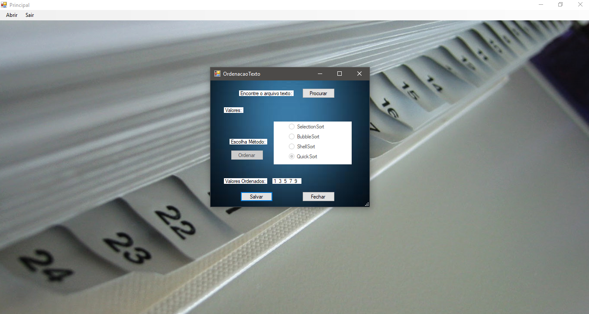
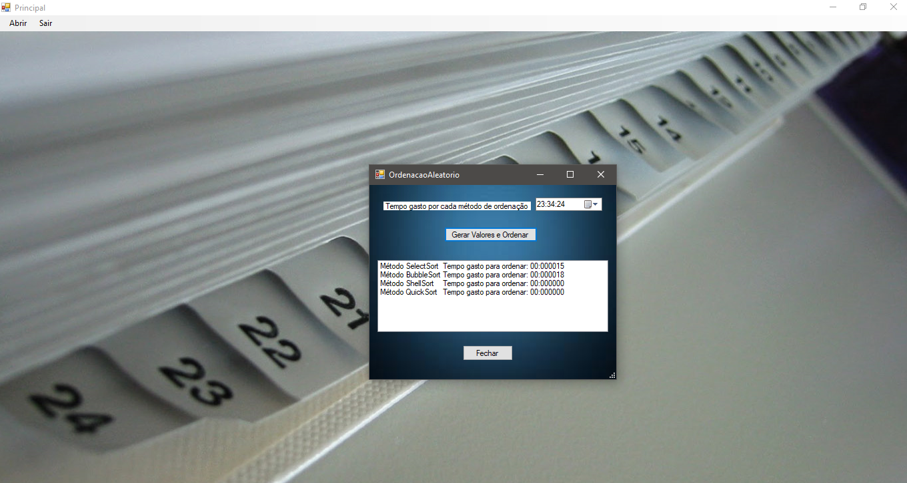

# Métodos de Ordenação e Pesquisa

  Trabalho proposto pela professora Jaqueline na disciplina de Métodos de Ordenação e Pesquisa(4º Período) do curso de Ciência da Computação com objetivo de estudar os métodos de ordenação Selection Sort, Bubble Sort, Shell Sort e Quick Sort. Como linguagem de programação, foi utilizado o C# em conjunto com Windows Forms.
  Desenvolvido em parceria com Willian Mariano, este trabalho explora e compara a performance dos métodos de ordenação acima citados. Você pode optar por ordenar uma sequência de números contida em um arquivo de texto(.txt), ou pode ordenar uma sequência de 100000 números aleatórios e ver a diferença de performance entre cada método. Em alguns casos, o hardware da máquina somado a eficiência de alguns algoritmos podem fazer a tarefa em um tempo tão curto, que o Timer do C# não é capaz de mensurar. 
  
ATENÇÃO: Para ordenar números contidos em um arquivo de texto, é importante separar cada número por um espaço em branco, caso contrário haverá erro! 

Capturas de tela:

